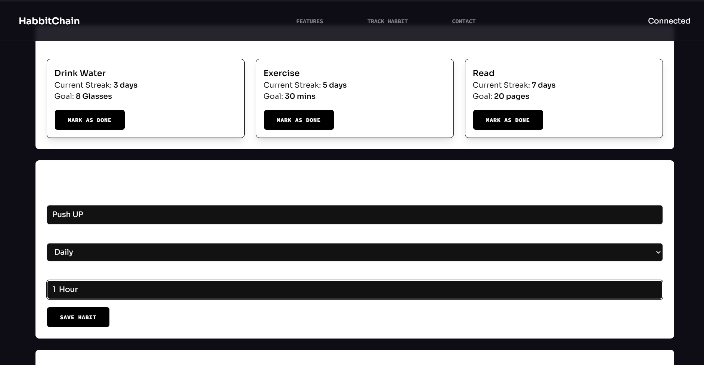
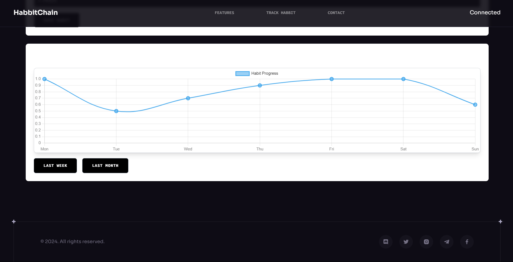
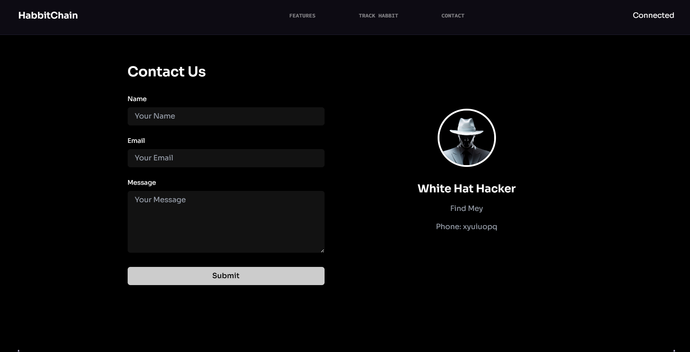

# Habbitchain - Blockchain-Based Habit Tracker

## Overview
Habbitchain is an innovative habit-tracking application that leverages blockchain technology to securely store user habit data while rewarding users for maintaining positive habits. By integrating with a decentralized wallet, users can track their progress and claim rewards in a secure and transparent manner.

## Features
- **Track Your Habits**: Easily add and monitor daily, weekly, or monthly habits.
- **Blockchain-Powered**: Data is securely stored on the blockchain, providing transparency and security.
- **Wallet Integration**: Connect to your decentralized wallet to track and claim rewards for consistent habit completion.
- **Rewards System**: Earn rewards in the form of tokens for maintaining good habits.
- **Cross-Device Compatibility**: Track your habits across multiple devices.
  
## How It Works
1. **Connect to Wallet**: Users can connect their wallet to Habbitchain, which stores habit data on the blockchain.
2. **Track Progress**: Monitor habit completion via intuitive graphs and dashboards.
3. **Earn Rewards**: Receive token rewards for maintaining positive habits over time.

## UI Preview
### Hero Section (Main Page)


The main page introduces users to Habbitchain, highlighting its key features and how to connect with a wallet.

### Habit Tracker Page

 Graph


This page shows the user’s tracked habits and the option to monitor progress through graphs.

### Contact Page


Users can get in touch with support or learn more about Habbitchain on the contact page.

## Getting Started
To run the app locally, follow these steps:

1. Clone the repository:
   ```bash
   git clone https://github.com/shubhxtech/habbitchain.git
